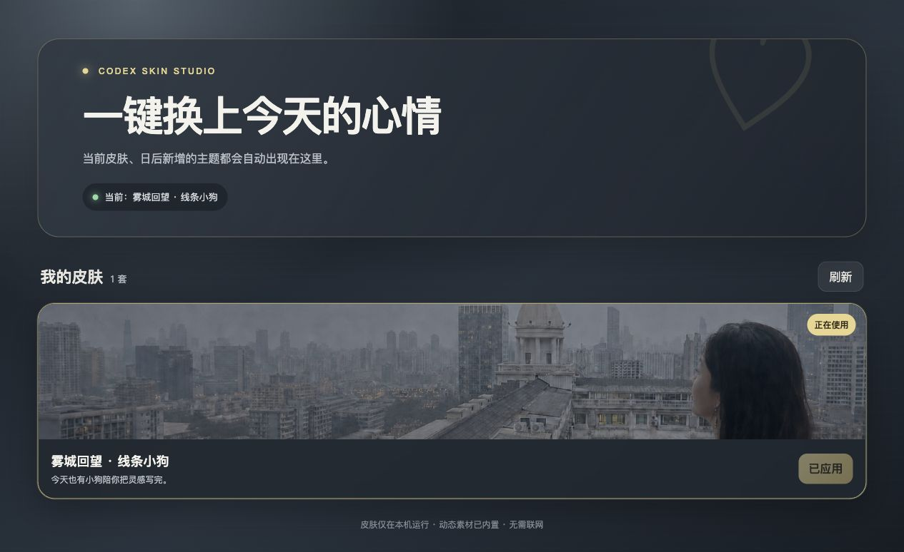

# Bananabb · 雾城回望 Codex 皮肤

  <strong>中文</strong> · <a href="./README.en.md">English</a>

  <strong>阴天、城市与两只小狗组成的 Codex 工作界面。</strong> 
  完整 UI 设计 · 动态表情 · Mac / Windows · 本地皮肤中心 
  工具开发：讨厌下雨的天空

   
  真实 Codex 界面录制；项目和账号文字已替换为演示内容。

## 项目定位

这是 Bananabb 的公开展示仓库，只提供效果预览、使用说明、许可证和少量非运行示例。完整 GIF 库、人物背景原图、安装器与皮肤运行引擎不存放在公开 Git 历史中。

- 主页四类操作卡片及独立动态素材；
- 卡片展开后的四项二级状态；
- 项目选择菜单与右侧新建项目子菜单；
- 侧边栏入口、项目列表、选中态和角色交替；
- 跟随 Codex 字号和窗口尺寸的响应式表情尺寸；
- Mac / Windows 共用的本地皮肤中心。

## 卡片二级状态

   
  四项操作直接进入首屏，聊天框保持在卡片下方且互不遮挡。

## 项目菜单与侧边栏

   
  项目菜单和二级子菜单同时展开，每个入口使用独立动态素材。

   
  侧边栏入口、项目图标、选中状态与相邻角色节奏。

## 皮肤中心

   
  本地预览、应用、状态同步与未来多主题切换入口。

## 卡密申请与使用限制

> 版本变化请查看 [更新日志](./CHANGELOG.md)。

最新版 Mac 与 Windows 卡密安装包通过本仓库的 [Releases](https://github.com/zcq19991029/bananabb/releases) 发布。压缩包不再使用共享解压密码；安装或首次启动时会打开浏览器完成账号和设备授权。

1. 进入 [Bananabb 卡密申请中心](https://bananabb-license-center.bananabb-zcq19991029.workers.dev/)，使用 GitHub 登录并提交申请。
2. 提交后请使用原 GitHub 账号重新打开或刷新申请中心查看状态。管理员审批通过后，卡密会显示在“我的申请与卡密”页面。
3. 若长时间仍未处理，请邮件联系 `2546605157@qq.com`，并附 GitHub 用户名、申请平台和申请时间。
4. 从 Releases 下载对应系统的 `Card-License.zip`，解压并运行安装入口。
5. 安装器会自动打开激活页。使用申请时的 GitHub 账号登录，并输入获批卡密。

每张卡密只绑定一个 GitHub 账号和一台设备；同一 GitHub 账号可以经审批获得多张卡密。授权包含个性化水印编号，可冻结、恢复、永久撤销或由管理员解绑设备。冻结或撤销会在用户下次启动皮肤时生效。

**申请和取得卡密仅代表个人娱乐、非商业用途的单设备使用许可。任何商业使用、收费安装、销售、转售、捆绑销售、分享卡密、分享安装包、重新上传或二次分发均被明确禁止。涉及第三方美术素材权利，不存在商业授权或豁免。**

详细说明见 [使用与授权说明](./docs/USAGE.md)。`examples/` 中的文件仅用于展示设计令牌结构，不能独立安装或还原完整皮肤。

## 使用限制

本仓库不是开源软件，仅供个人娱乐用途。

**任何人一律禁止商用与盈利（包括商业使用、收费安装、销售、捆绑销售等）。此为绝对禁止条款，不存在任何授权或豁免——涉及第三方美术素材权利，作者本人也无权且不会给予任何商用许可。**

未经作者书面许可，同时禁止：

- 转发卡密、分享安装包或重新上传镜像；
- 复制、提取、重新打包或分发展示素材；
- 以修改版、换名版或衍生包形式再次发布。

完整条款见 [LICENSE](./LICENSE)。线条小狗等第三方美术素材的权利仍归其原作者或权利人，本许可证不授予相关权利。

## 说明

- 本项目不是 OpenAI 官方产品。
- 公开仓库不包含可直接运行的换肤引擎。
- Release 仅提供启用账号、卡密和单设备校验的 Mac/Windows 安装包。

---

雾天不一定沉闷。让小白和小鸡毛陪你把今天的代码写完。
